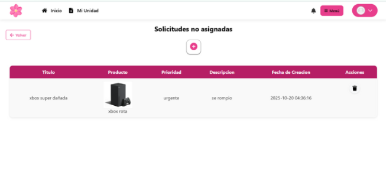
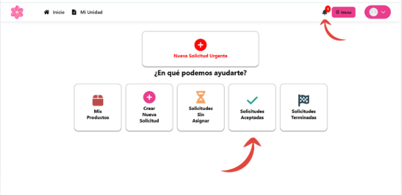
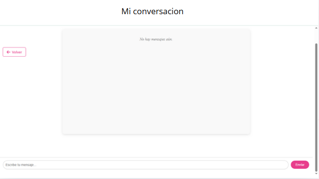

# Technical Service Management Web System _COSMOS_.

<h3 align="center">

</h3>

Made by:
* _Thiago Carballo_
* _Alex González_
* _Federico Mosegui_
* _Franco Fagundez_
* _Lucas Vargas_
* _Sergio López_

_**COSMOS**_ is an innovative web platform designed to connect customers in need of emergency technical services with qualified freelance technicians. Our mission is to simplify the process of finding professional help for computer repairs, offering a transparent and efficient experience for both customers and technicians.

## How does it work?

### Need help navigating our site? Here's a step-by-step guide to help you stay connected.​

The first step is to access our site from your preferred browser. Once there, click "Start Now" or the Register button.​

## Now you must register with your details, choose the Client role and a photo, but the latter is optional.

### Once the fields are completed, click on save and continue.

## Once logged in

### click the red button to create a new urgent request.

## In urgent request you must create a product

### This product will be associated with the request, your product is your damaged device, make sure to complete all fields and choose the appropriate category for your device.

## Now the request

### Now you should give it a title and a description that explains in more detail the problem with your device, your device (newly created product) and urgency level will be chosen automatically.

## Request created

### Now your request has been published and is waiting for a technician to accept it and start contacting you for the arrangement.

## Your application was accepted

### Once your application is accepted, you will receive a notification of your acceptance and you can learn more about it at: accepted applications

## in accepted applications

### Here you can see data such as the technician who accepted the request, its status, and you can start a conversation with the technician

## in the chat

### In the chat you will have a conversation with the technician to agree on the price, delivery time, etc.

## your request is complete

### Once your request is completed, in addition to receiving the notification, it will also be displayed under: Completed Requests. And through the previously viewed chat, you will arrange with the technician for the recovery of your device and payment to the technician.

## Thanks for reading

### We hope this guide has been helpful in using our website. For any other questions, please contact our technical support team at 420 69 67  or at our Gmail address: tecnicosasociados@gmail.com