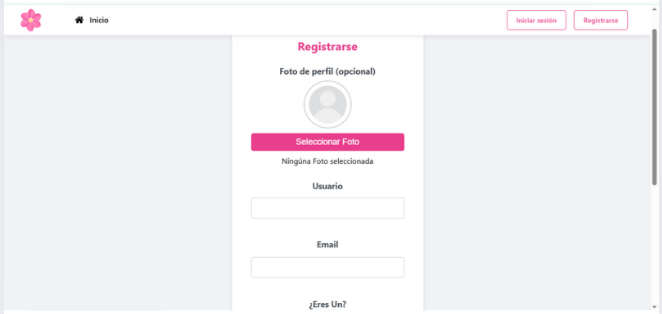
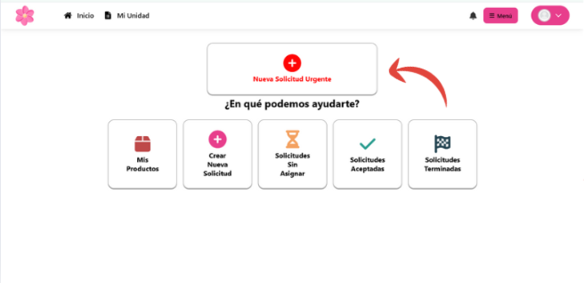
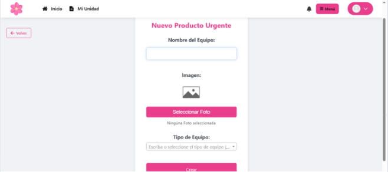
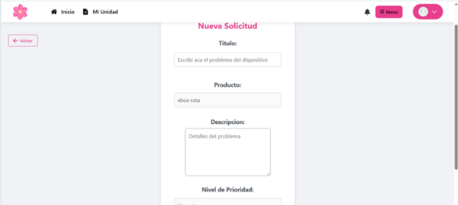

# Sistema Web de Gestión de Servicio Técnico _COSMOS_.

<h3 align="center">

</h3>

Hecho por: 
* _Thiago Carballo_
* _Alex González_ 
* _Federico Mosegui_ 
* _Franco Fagundez_
* _Lucas Vargas_
* _Sergio López_

_**COSMOS**_ es una plataforma web innovadora diseñada para conectar a clientes que necesitan servicios técnicos de emergencia con técnicos freelancers cualificados. Nuestra misión es simplificar el proceso de encontrar ayuda profesional para la reparación de equipos informáticos, ofreciendo una experiencia transparente y eficiente tanto para clientes como para técnicos.

## ¿Cómo funciona?

### Para los Clientes

### ¿Necesitas ayuda para navegar por nuestro sitio? Aquí tienes una guía paso a paso para mantenerte conectado.

### El primer paso es acceder a nuestro sitio desde tu navegador preferido. Una vez allí, haz clic en "Comenzar ahora" o en el botón "Registrarse".

## Ahora debes registrarte con tus datos, elegir el rol de Cliente y una foto (esta última es opcional).

### Una vez completados los campos, haz clic en "Guardar y continuar".

## Una vez iniciada la sesión

### Haga clic en el botón rojo para crear una nueva solicitud urgente.

## En caso de solicitud urgente, debe crear un producto.

### Este producto se asociará a la solicitud. Su producto es su dispositivo dañado. Asegúrese de completar todos los campos y seleccionar la categoría adecuada para su dispositivo.

## Ahora la solicitud

### Ahora debes asignarle un título y una descripción que explique con más detalle el problema con tu dispositivo. Tu dispositivo (producto recién creado) y el nivel de urgencia se seleccionarán automáticamente.

## Solicitud creada

### Su solicitud ya se ha publicado y está a la espera de que un técnico la acepte y comience a contactarle para coordinarla.

## Su solicitud fue aceptada

### Una vez que su solicitud sea aceptada, recibirá una notificación de aceptación y podrá obtener más información en: solicitudes aceptadas

## en solicitudes aceptadas

### Aquí puede ver datos como el técnico que aceptó la solicitud, su estado y puede iniciar una conversación con él.

## en el chat

### En el chat, conversarás con el técnico para acordar el precio, el plazo de entrega, etc.

## Su solicitud está completa

### Una vez completada su solicitud, además de recibir la notificación, también se mostrará en "Solicitudes completadas". A través del chat que vio anteriormente, podrá coordinar con el técnico la recuperación de su dispositivo y el pago correspondiente.

## En solicitudes Terminadas

### aqui aparte de ver sus solicitudes que fueron completadas, tambien tendra la opcion de calificar el servicio del tecnico acargo de su dispositivo dandole click al boton de la estrellita.

## Calificar el Servicio del Tecnico

### aqui podra dar una calificacion personal sobre como fue el servicio del tecncio que estuvo a cargo de su dispositivo, puede darle desde media estrella hasta 5 estrellas (siendo media estrella un mal servicio y 5 estrellas siendo un muy buen servicio) y puede adjuntar un comentario con su opinion. agradecemos que se tome la molestia de calificar nuestros tecncios.

## Gracias por leer

### Esperamos que esta guía le haya sido útil al usar nuestro sitio web. Si tiene alguna otra pregunta, comuníquese con nuestro equipo de soporte técnico al +598 98 431 475 o a nuestra dirección de Gmail: tecnicosasociados0@gmail.com

## Para los tecnicos

### Hola Tecnico nos alegra que uses nuestra web para tu trabajo, Aquí tienes una guía paso a paso para mantenerte conectado.

### El primer paso es acceder a nuestro sitio desde tu navegador preferido. Una vez allí, haz clic en "Comenzar ahora" o en el botón "Registrarse".

## Ahora debes registrarte con tus datos, elegir el rol de Tecnico y una foto (esta última es opcional).

### Una vez completados los campos, haz clic en "Guardar y continuar".

## Una vez iniciada la sesión

### ahora en su Unidad tendra las opciones para manejar el tema de las solicitudes, podra ver solicitudes en el boton de solicitudes disponibles.

## En solicitudes disponibles

### aqui podra ver todas las solicitudes que no fueron asignadas aun, cada una con un titulo, una imagen, el nombre del cliente, y una descripcion con el problema del dispositivo, tambien tendra una barra de busqueda para filtrar por solicitudes especificas si asi lo desea, y dandole al boton del tick a la derecha podra aceptar la solicitud.

## ver sus solicitudes aceptadas

### dandole al boton de volver o el que dice "mi unidad" podra volver a la seccion anterior y en el boton de solicitudes aceptadas podra ver todas las solicitudes que usted acepto y podra ponerse a trabajar con ellas.

## En Solicitudes aceptadas

### aqui no solo vera las solicitudes aceptadas, en cada solicitud tendra distintos botones para interactuar y trabajar con cada solicitud, a continuacion que hace cada una.

## Editar solicitud <i class="fa fa-comments"></i>
